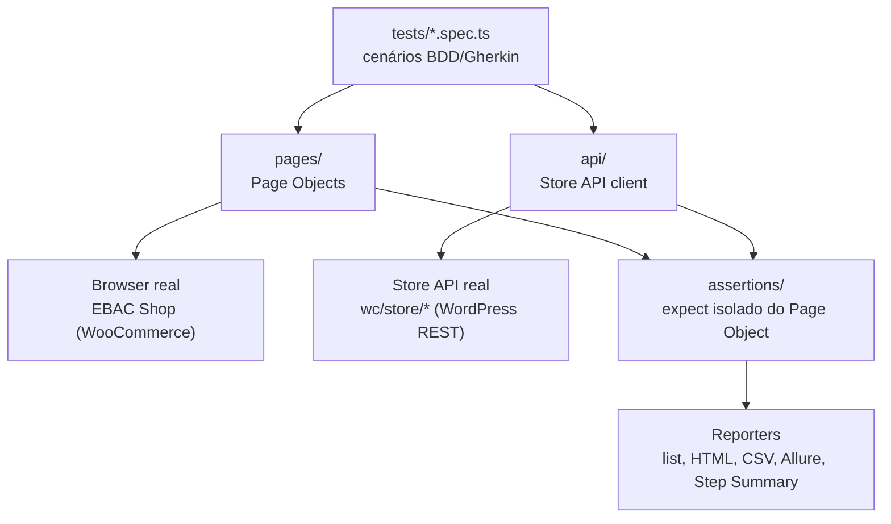
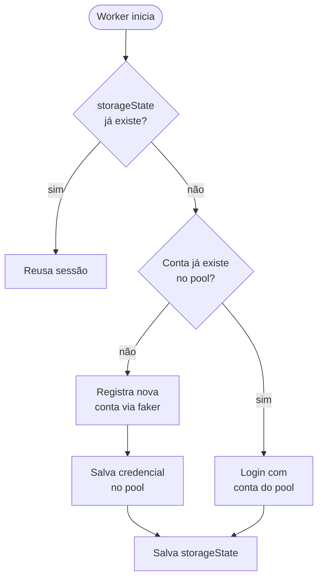
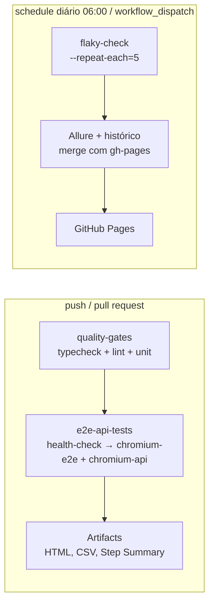

<div align="center">

# Aarin: EBAC Shop QA Automation

**Suíte de automação E2E e API para o desafio técnico da EBAC Shop** (loja WooCommerce), construída com Playwright + TypeScript sob mentalidade de framework: preparada para crescer de dezenas para centenas de cenários sem retrabalho estrutural.

[](https://github.com/alchemist-developer/ebac-shop-testcase/actions/workflows/playwright.yml)
[](https://github.com/alchemist-developer/ebac-shop-testcase/actions/workflows/flaky-check.yml)


[](https://www.conventionalcommits.org)

</div>

## Sumário

1. [Stack](#stack)
2. [Como rodar](#como-rodar)
3. [Autenticação](#autenticação)
4. [Observabilidade](#observabilidade)
5. [Estratégia de testes](#estratégia-de-testes)
6. [CI/CD](#cicd)
7. [Versionamento](#versionamento)
8. [Estrutura](#estrutura)
9. [Limitações conhecidas](#limitações-conhecidas)
10. [Desafio de Investigação](#desafio-de-investigação-o-cliente-paga-mas-o-pedido-não-aparece-em-meus-pedidos)

## Stack

- **Playwright + TypeScript**: E2E (browser) e API testing na mesma ferramenta, evitando duplicar infraestrutura de teste.
- **Page Object Model**: uma classe por página (`pages/`), sem lógica de asserção dentro dela.
- **Assertions isoladas** (`assertions/`): toda lógica de `expect` fica separada dos Page Objects, para reuso entre cenários e leitura direta das regras de negócio validadas.
- **Dados obtidos em runtime via Store API** (`api/ProductCatalog.ts`, `utils/currency.ts`), não fixados em fixtures:
  - Produto, preço e moeda usados nos testes de compra e desconto vêm da API no momento da execução, não de um `test-data/*.ts` hardcoded.
  - Um teste falha por comportamento real quebrado, não porque o catálogo mudou desde que alguém escreveu a fixture.
  - `test-data/` guarda só o que é configuração legítima do ambiente (ex.: texto do botão de finalizar compra), não dado de negócio.
- **Utils puras** (`utils/`): cálculo de desconto e parsing de moeda testável isoladamente, sem depender do browser.
- **ESLint (flat config) + typescript-eslint (type-checked) + eslint-plugin-playwright**: gate estático de correção de tipos, promises e anti-padrões específicos de Playwright (ex.: assertion ausente, wait arbitrário).

### Arquitetura em camadas

Cada camada tem uma responsabilidade única: trocar a implementação de uma não exige tocar nas outras.



## Como rodar

```bash
npm ci
npx playwright install --with-deps chromium

cp .env.example .env.local   # ou edite .env diretamente
# preencha BASE_URL

npm run typecheck    # tsc --noEmit
npm run lint         # eslint .
npm run test:unit    # funções puras (utils/), sem browser
npm run test:e2e     # cenários E2E (browser)
npm run test:api     # cenários de API
npx playwright test  # suíte completa (unit + e2e + api)
```

### Ambientes

`TEST_ENV` seleciona o arquivo de configuração (`config/environment.ts`):

- `TEST_ENV=local` (padrão) carrega `.env`.
- Qualquer outro valor carrega `.env.<TEST_ENV>` (ex.: `TEST_ENV=staging` → `.env.staging`).
  - Falha explicitamente se o arquivo não existir e `BASE_URL` não estiver setado: erro cedo, em vez de rodar contra ambiente errado.

**Moeda de exibição** (símbolo, separador decimal/milhar): lida diretamente da Store API (`prices.currency_*` de qualquer produto, via `utils/currency.ts`) nos testes E2E, sem lookup hardcoded `.br → BRL`.
- Exceção deliberada: o teste de contrato da própria API (`tests/api/store-api.spec.ts`) precisa de um oráculo independente da resposta que está validando, então usa `getCurrencyForBaseUrl` (`test-data/market.ts`), inferido do hostname do ambiente.

## Autenticação

Cada **worker paralelo** do Playwright cria sua própria conta e mantém sua própria sessão (`tests/support/authFixtures.ts`), em vez de todos os testes compartilharem uma conta fixa e um único `storageState` gerado uma vez.

- **Por quê**: o carrinho da loja vive na sessão do servidor. Testes que reaproveitam a mesma sessão colidem entre si (um adiciona produto A, outro produto B, e a asserção do primeiro lê o produto errado).

**Como chegamos até aqui** (duas evoluções reais, motivadas por problemas concretos encontrados rodando a suíte, não por preferência estética):

1. **Conta fixa + lock → registro dinâmico.**
   - A versão original usava uma conta fixa (`TEST_USER`/`TEST_PASSWORD`) com um lock de arquivo para serializar logins, porque logins simultâneos da mesma conta causavam timeout intermitente nesta aplicação.
   - Isso era um workaround em cima do sintoma: a causa raiz era compartilhar uma única identidade entre workers concorrentes.
   - A correção foi eliminar o compartilhamento: cada worker registra dinamicamente sua própria conta via `POST /minha-conta/` (formulário de registro nativo da loja, confirmado por exploração direta: sem verificação de e-mail nem captcha, login automático após o registro), com dados gerados por `@faker-js/faker` (`utils/testUser.ts`).
   - Sem conta compartilhada, não há mais concorrência para serializar, e o lock foi removido.

2. **Registro sempre novo → pool reutilizável.**
   - Essa loja não expõe nenhum jeito de uma conta se autoexcluir (ver [Limitações](#limitações-conhecidas)), então registrar uma conta nova a cada execução faria o número de contas crescer sem limite para sempre.
   - `utils/testUserPool.ts` persiste a credencial de cada conta criada (`playwright/.auth/pool/worker-N.json`, git-ignorado); na próxima vez que aquele worker precisar autenticar, ele *loga* na conta existente em vez de registrar outra.
   - Localmente esse arquivo persiste em disco. No CI, `playwright.yml` e `flaky-check.yml` cacheiam essa pasta entre execuções (`actions/cache`, chave única por run com `restore-keys` pegando a mais recente), então mesmo um runner limpo a cada job reaproveita o mesmo pool pequeno de contas indefinidamente.

O resultado é essa decisão por worker (`tests/support/authFixtures.ts`):



`workerStorageState` (`tests/support/authFixtures.ts`) cria a conta e o `storageState` uma única vez por worker, cacheado em `playwright/.auth/worker-N.json` (git-ignorado) e reaproveitado em reexecuções locais dentro do mesmo checkout.

**Detalhes menores:**
- `CartPage.emptyCart()` roda no início de todo teste que muta o carrinho: defesa contra estado residual quando o mesmo worker reexecuta um teste em sequência (sessão cacheada, não recriada a cada teste).
- Specs sem necessidade de autenticação (`discount-flow.spec.ts`) não usam `storageState`: cada teste recebe um contexto de browser novo do Playwright, com sessão de convidado isolada por padrão.
- Se o registro falhar (ex.: e-mail duplicado), a asserção falha rapidamente com a mensagem retornada pela própria aplicação (`.woocommerce-error`), em vez de um timeout genérico. Ver `assertions/accountAssertions.ts`.

## Observabilidade

Problemas concretos de diagnóstico, cada um endereçado diretamente:

- **Falha de infraestrutura não deve parecer falha de produto.**
  - `tests/support/healthCheck.setup.ts` roda como dependência (`dependencies: ['health-check']`) de `chromium-e2e` e `chromium-api`, não de `unit`, que não precisa da aplicação no ar.
  - Se `BASE_URL` estiver inacessível, a suíte falha com **um** erro no topo do relatório ("this is an infrastructure issue, not a test failure") e os demais testes aparecem como `did not run`, em vez de N timeouts genéricos espalhados pelo relatório.
  - Validado localmente apontando `BASE_URL` para um host inexistente.

- **Teste flaky não deve se disfarçar de teste estável.**
  - `.github/workflows/flaky-check.yml` roda a suíte E2E/API todo dia (`cron: '0 6 * * *'`, mais `workflow_dispatch` para rodar sob demanda) com `--repeat-each=5 --workers=4 --retries=0`.
  - `retries=0` é deliberado: um retry mascararia exatamente o sintoma que esse workflow existe para capturar.
  - Validado localmente com a mesma combinação de flags antes de subir o workflow.

- **Resultado estruturado para análise além do relatório HTML.**
  - `reporters/csvReporter.ts` é um reporter Playwright customizado que grava `reports/results.csv` a cada execução: id do cenário, projeto, status, status esperado, `outcome`, duração, retry, `repeatEachIndex`, arquivo e a primeira linha do erro.
  - A coluna que importa é `outcome` vs. `status`: se algum cenário futuro precisar documentar uma falha esperada via `test.fail()`, ele aparece com `status=failed` e `outcome=expected`, distinção que uma ferramenta de análise (ou uma IA lendo o CSV) precisa para não tratar um defeito documentado como regressão nova. Nenhum cenário atual usa `test.fail()` (o único caso, `E2E-CART-QUANTITY-001`, foi corrigido para um teste E2E positivo — ver [Limitações conhecidas](#limitações-conhecidas)); o mecanismo continua coberto pelo reporter para quando for necessário de novo.
  - Subido como artifact em toda execução de CI (`actions/upload-artifact`, `if: always()`), inclusive nas que passam, para dar histórico de execução pronto para consumo automatizado sem depender de parsear HTML.

- **Resultado visível sem baixar nada.**
  - O mesmo `reporters/csvReporter.ts` escreve um resumo em Markdown direto no `$GITHUB_STEP_SUMMARY` do job (tabela com total/passou/falha conhecida/falha inesperada/flaky/pulado, mais o detalhe de cada cenário em um `<details>`), usando os mesmos dados já coletados em memória, sem reparsear o CSV.
  - Aparece na própria página do workflow run no GitHub, sem precisar baixar artifact.
  - Não faz nada localmente (a variável só existe dentro do runner do GitHub Actions).

- **Tendência de flakiness entre execuções, não só por execução.**
  - `flaky-check.yml` já rodava a suíte repetida, mas não acumulava histórico entre as execuções noturnas.
  - Agora o job gera resultados no formato Allure (`allure-playwright`, configurado em `playwright.config.ts`) e usa `simple-elf/allure-report-action` para mesclar com o histórico do branch `gh-pages` (`actions/checkout` desse branch antes, com `continue-on-error: true` para não quebrar na primeira execução), publicado de volta via `peaceiris/actions-gh-pages`.
  - **[Relatório ao vivo](https://alchemist-developer.github.io/ebac-shop-testcase/)**, publicado a cada execução do `flaky-check.yml` via GitHub Pages (Settings → Pages → Source: Deploy from a branch → `gh-pages` / `root`).
  - Localmente, gerar o relatório Allure (`npm run report:allure`) exige Java instalado (`allure-commandline` é uma ferramenta Java); no CI isso não é um problema porque o runner do GitHub já vem com Java.

## Estratégia de testes

Cobertura definida por análise de risco sobre o fluxo de compra, não por cobertura exaustiva de UI:

| Risco | Cenário | Técnica |
|---|---|---|
| Produto sem controle de compra ainda expõe ação de compra | `E2E-PURCHASE-002` | Teste negativo: partição de equivalência (produto comprável vs. não comprável) |
| Preço/quantidade exibidos no carrinho e checkout divergem do produto comprado | `E2E-PURCHASE-001` | E2E positivo, ponta a ponta até o checkout; produto e preço vêm da Store API no momento do teste (não de fixture), comparados contra o carrinho renderizado |
| Desconto exibido no card não bate com o cálculo real (`(original-promo)/original`) | `E2E-DISCOUNT-001` | Validação numérica cruzada UI × cálculo, com precisão configurável |
| Desconto exibido corretamente no card, mas preço cobrado no carrinho é o original | `E2E-DISCOUNT-002` | Rastreabilidade de valor entre página de vitrine e carrinho: o risco mais crítico de um fluxo de desconto (perda financeira silenciosa) |
| Contrato da Store API (produtos e carrinho) muda sem quebrar o front | `API-WC-STORE-PRODUCTS-001`, `API-WC-STORE-CART-001` | Contrato mínimo observado via API, independente de UI: mais rápido e estável que validar o mesmo via browser |
| Parsing de preço/percentual falha silenciosamente (ex.: elemento vazio na página vira "R$0,00" em vez de erro) | `UNIT-DISCOUNT-CALC-*`, `UNIT-DISCOUNT-PARSE-*` | Unitário: particionamento de equivalência (classe válida/inválida) e valor-limite (0%, 100%, preço = 0) sobre `utils/discountCalculator.ts` |
| Quantidade alterada pela UI não reflete no subtotal cobrado | `E2E-CART-QUANTITY-001` | E2E positivo sobre produto `variable` (não `sold_individually`); a quantidade trava em 1 apenas para produtos `sold_individually`, regra coberta à parte |
| Regra de negócio de quantidade por item (existe e é aplicada pelo backend, mesmo sem UI) | `API-WC-CART-UPDATE-ITEM-001`, `API-WC-CART-SOLD-INDIVIDUALLY-001` | Cobertura de API no nível onde a regra é de fato observável, complementar (não substituta) ao teste de UI acima |

Cada cenário tem um ID rastreável (`[E2E-PURCHASE-001]`, `[API-WC-STORE-CART-001]` etc.) espelhado no BDD/Gherkin em comentário acima do `test.describe`/`test`, para rastreabilidade entre risco → cenário → asserção sem depender de uma ferramenta BDD dedicada (Cucumber não trouxe valor aqui dado o tamanho atual da suíte, decisão pragmática, revista se o volume de cenários por stakeholder não-técnico crescer).

## CI/CD



**`.github/workflows/playwright.yml`** roda em push (`main`, `feat/**`) e pull requests para `main`, em dois jobs sequenciais (fail-fast: o segundo só roda se o primeiro passar). [Ver execuções e baixar os artifacts](https://github.com/alchemist-developer/ebac-shop-testcase/actions/workflows/playwright.yml) (relatório HTML, CSV, traces em falha):

1. **`quality-gates`**: `typecheck` + `lint` + `test:unit`.
   - Não sobe browser, não depende da aplicação real estar no ar (`BASE_URL=http://localhost` fixo só para satisfazer o import de `config/environment.ts`, que exige a variável estar setada; nenhum teste deste job faz requisição real).
   - Falha em segundos, antes de gastar tempo de CI com um teste E2E contra um site externo.
2. **`e2e-api-tests`**: roda `chromium-e2e` + `chromium-api` (o projeto `health-check` é puxado automaticamente como dependência).
   - Restaura o pool de contas de teste antes (`actions/cache`, ver [Autenticação](#autenticação)).
   - Instala só o Chromium (`playwright install --with-deps chromium`, único browser usado pelos projetos configurados).
   - `retries: 2` e `workers: 1` em CI (`playwright.config.ts`, condicionado a `process.env.CI`): restrição conservadora para não sobrecarregar o site de teste compartilhado, não uma necessidade de isolamento (a autenticação por worker foi validada localmente sob 8 workers concorrentes reais, `npx playwright test tests/e2e/purchase-flow.spec.ts --workers=8 --repeat-each=5`, 10/10 sem colisão de carrinho).
   - Upload do relatório HTML sempre, e de `test-results/` (traces, vídeo, screenshot) só em falha.

**`.github/workflows/flaky-check.yml`**: ver [Observabilidade](#observabilidade). [Ver execuções](https://github.com/alchemist-developer/ebac-shop-testcase/actions/workflows/flaky-check.yml), incluindo o relatório Allure publicado a cada run.

**Antes do primeiro run**, configurar a repository variable `BASE_URL` (Settings → Secrets and variables → Actions → Variables) com a URL do ambiente sob teste.
- Nenhuma credencial é necessária: a autenticação não depende de secrets (ver [Autenticação](#autenticação)).
- Sem `BASE_URL` configurada, o job falha explicitamente em vez de rodar contra um valor padrão fixo no código (mesmo princípio de `config/environment.ts`: configuração de ambiente não é hardcoded).

## Versionamento

Histórico de commits segue [Conventional Commits](https://www.conventionalcommits.org/) (`feat:`, `fix:`, `test:`, `docs:`, `style:`, `refactor:`, `build:`, `chore:`), uma unidade lógica por commit. Cada commit passa isoladamente por typecheck, lint e a suíte antes de existir, não é só uma mensagem formatada em cima de mudanças misturadas.

Exemplo real: [PR #1](https://github.com/alchemist-developer/ebac-shop-testcase/pull/1), com os commits organizados e a descrição de merge.

## Estrutura

```
api/            clientes de API (Store API) e seleção dinâmica de produtos (ProductCatalog)
assertions/     lógica de expect, isolada dos Page Objects
config/         configuração por ambiente e autenticação
pages/          Page Objects
reporters/      reporter customizado do Playwright (exporta reports/results.csv)
test-data/      configuração de ambiente que é legitimamente estática (não dado de negócio)
tests/
  e2e/          cenários E2E
  api/          cenários de API
  unit/         testes unitários de funções puras (projeto `unit`, sem browser)
  support/      fixtures compartilhadas entre specs (autenticação por worker, health-check do ambiente)
utils/          funções puras (cálculo de desconto, parsing de moeda, moeda a partir de produto, geração e pool de usuário de teste)
```

## Limitações conhecidas

- **Quantidade travada em 1 é uma regra de negócio por produto (`sold_individually`), não uma limitação da loja inteira.**
  - Versão anterior deste README afirmava "input hidden, 99/99 produtos, sem exceção", essa conclusão estava errada, chegou de testar só produtos `type: 'simple'`. Neste catálogo os 6 produtos `simple` são todos `sold_individually: true` (quantidade trava em 1 por design, correto) e os 93 produtos `variable` são todos `sold_individually: false`, com `<input type="number">` funcional tanto na página do produto quanto no carrinho.
  - Corrigido depois de feedback de processo seletivo apontar que os próprios testes já indicavam um caminho viável, a amostragem (só `simple`) garantia a conclusão "impossível" antes mesmo de rodar.
  - `tests/e2e/cart-quantity.spec.ts` agora cobre o caminho real: seleciona um produto `variable` via `ProductCatalog.findPurchasableVariation`, altera a quantidade pela UI (stepper + "Update Cart") e valida o subtotal recalculado. `assertions/cartAssertions.ts#expectQuantityControl` continua cobrindo os dois comportamentos (hidden para `sold_individually`, editável para os demais).
  - A regra de negócio também é coberta a nível de API (`tests/api/cart-mutation.spec.ts`), complementar, não substituta, à cobertura de UI.

- **Contract testing não usa uma especificação formal.**
  - Não há OpenAPI/Swagger publicado para a EBAC Shop. O que existe, confirmado por exploração direta (`OPTIONS` em qualquer rota `wc/store/*`), é a auto-descrição nativa da WordPress REST API: um JSON Schema completo por endpoint.
  - `tests/api/contract.spec.ts` usa esse schema como oráculo, validando só os campos dos quais este projeto depende (não o catálogo inteiro).

- **Instabilidade sob carga.** Sob 6 workers locais simultâneos batendo em endpoints de mutação de carrinho, observei um 502 isolado (1 em 13 tentativas). Reforça a decisão de manter `workers: 1` no CI contra o ambiente compartilhado.

- **Não existe exclusão self-service de conta neste ambiente.**
  - Confirmado por exploração direta antes de decidir a arquitetura: `/minha-conta/edit-account/` não tem opção de apagar conta, não há página de privacidade/GDPR para solicitar apagamento de dados, e tanto a API REST do WordPress (`wp/v2/users/{id}`) quanto a administrativa do WooCommerce (`wc/v3/customers/{id}`) exigem permissão de admin para `DELETE`, que uma conta de cliente comum não tem.
  - Mitigação implementada: reuso via pool (ver [Autenticação](#autenticação)), não deleção.
  - Se credenciais administrativas ficarem disponíveis no futuro, a alternativa mais completa seria um teardown chamando `DELETE /wp-json/wc/v3/customers/{id}?force=true` ao final de cada worker.

- **O pool de contas é indexado por `workerIndex` do Playwright, que só é garantidamente estável (0, 1, 2...) dentro de uma única execução.**
  - Em CI (runner limpo por job) isso é confiável.
  - Localmente, se múltiplas invocações de `playwright test` rodarem em sequência muito rápida ou concorrentemente, o índice pode não repetir entre execuções, e o pool simplesmente não bate (o worker registra mais uma conta em vez de reaproveitar, sem quebrar nada, só perde a otimização naquela execução).

## Desafio de Investigação: "o cliente paga, mas o pedido não aparece em Meus Pedidos"

Cenário situacional: produção, sem acesso ao código-fonte, apenas logs básicos e apoio dos times de Produto e Backend.

### Primeira ação

Antes de investigar causa, eu delimitaria o problema com dados concretos: pediria ao time de Produto/Suporte de 3 a 5 casos reais recentes (e-mail ou ID do cliente, horário aproximado, meio de pagamento, e o ID da transação se estiver no comprovante do cliente). Sem isso, qualquer hipótese é especulação.

Eu não tenho acesso ao painel do gateway de pagamento nem à tabela de pedidos do backend, só a logs básicos e ao apoio dos times de Produto e Backend. Também não sei qual é a arquitetura entre o banco de dados e a tela "Meus Pedidos": pode ser leitura direta, mas pode muito bem existir uma cadeia como banco → API → cache → backend-for-frontend → frontend, e qualquer camada dessa pode estar servindo dado velho ou quebrado. Não vou assumir isso sem confirmar.

Então, com os casos concretos em mãos, minhas duas ações são:

1. **Sozinho, nos logs básicos que eu já tenho acesso**: procurar pelos horários/IDs dos casos reportados, atrás de erros, timeouts ou exceções em torno do fluxo de checkout/confirmação de pagamento.
2. **Formular um pedido específico ao time de Backend**, já que só eles têm acesso ao painel do gateway, aos logs de evento/webhook e à tabela de pedidos: para os casos concretos, rastrear o **mesmo identificador** (transaction/payment ID do gateway, ou um correlation ID se o sistema propagar um) por toda a cadeia:

   ```
   transaction/payment ID (gateway)
           ↓
   evento/webhook recebido pelo backend
           ↓
   order ID criado
           ↓
   pedido persistido e marcado como pago
           ↓
   GET /meus-pedidos (ou equivalente) retorna esse pedido
   ```

   Não peço "me dá acesso ao banco", peço o resultado desse rastreamento pontual para os casos que já tenho em mãos. Seguir um único ID pela cadeia inteira é mais forte do que cruzar dois logs soltos: o ponto exato onde o ID some (ou diverge) já aponta a causa, em vez de eu adivinhar entre sistemas.

### Hipótese inicial

Três hipóteses, cada uma correspondendo a um ponto diferente de quebra na cadeia acima, com uma evidência específica que confirma ou descarta cada uma:

| Hipótese | Onde quebraria na cadeia | Evidência que confirma |
|---|---|---|
| Falha na confirmação assíncrona do pagamento | Entre "transaction ID no gateway" e "evento/webhook recebido" | O ID aparece como pago no gateway, mas não há evento correspondente no log do backend (ou há, com erro/retry esgotado) |
| Pedido criado mas não vinculado à conta certa (ex.: checkout como convidado) | Entre "pedido persistido" e o cliente certo enxergar esse pedido | O pedido existe, pago, rastreável pelo ID, mas vinculado a um `customer_id` diferente do cliente que reclama (ou nenhum) |
| Camada de leitura desatualizada (cache, API ou BFF entre o banco e a tela) | Depois de "pedido persistido e marcado como pago" | O pedido existe, correto, vinculado ao cliente certo, rastreável ponta a ponta, e mesmo assim `GET /meus-pedidos` não retorna, ou seja, a escrita está inteira e o problema é só na leitura |

Minha aposta inicial é a primeira, porque é o ponto de falha mais comum em integração de pagamento (boleto/PIX dependem de confirmação assíncrona por callback, ao contrário de cartão com captura síncrona), e é a única das três que eu consigo justificar sem supor nada sobre uma arquitetura de leitura que não conheço.

### Como eu reduziria a incerteza rapidamente

Todos os itens abaixo são pedidos que eu levaria prontos ao time de Backend (a fonte do dado não é minha), não consultas que eu mesmo rodaria:

1. Rastrear o ID pela cadeia completa para os casos concretos. Isso sozinho já indica qual das três hipóteses da tabela é a real, sem precisar de instrumentação nova.
2. Se quebrar entre gateway e webhook: segmentar por **meio de pagamento**. Falha concentrada em boleto/PIX e ausente em cartão é evidência forte a favor dessa hipótese.
3. Se quebrar entre gateway e webhook: verificar se os casos coincidem com **deploy recente, mudança de configuração do gateway ou pico de tráfego** (fila/timeout sob carga). Times de Backend costumam ter essa timeline prontamente disponível.
4. Se o pedido existe mas com vínculo errado: checar se os casos têm em comum ter sido **checkout como convidado** seguido de login posterior, e se o e-mail do pedido bate com o da conta.
5. Se a cadeia de escrita estiver inteira e correta até a persistência: o problema passa a ser de leitura (cache, API ou BFF), e a pergunta muda de "o que quebrou no pagamento" para "por que essa camada não reflete o banco", direcionada a outro time.
6. Em paralelo, uma contagem de quantos pedidos ficaram presos além de um tempo razoável em cada ponto da cadeia. Isso estima o tamanho real do problema (1 caso isolado é diferente de uma falha sistêmica) e ajuda a priorizar.

Esse plano usa só o que já existe (meus logs básicos, e o acesso que os times de Produto e Backend já têm) antes de propor qualquer mudança de código ou instrumentação nova. Rastrear um identificador único pela cadeia inteira, em vez de cruzar logs soltos, é o que transforma "vasculhar" em um teste de hipótese com resultado binário em cada etapa (sequência de checagens sim/não).
